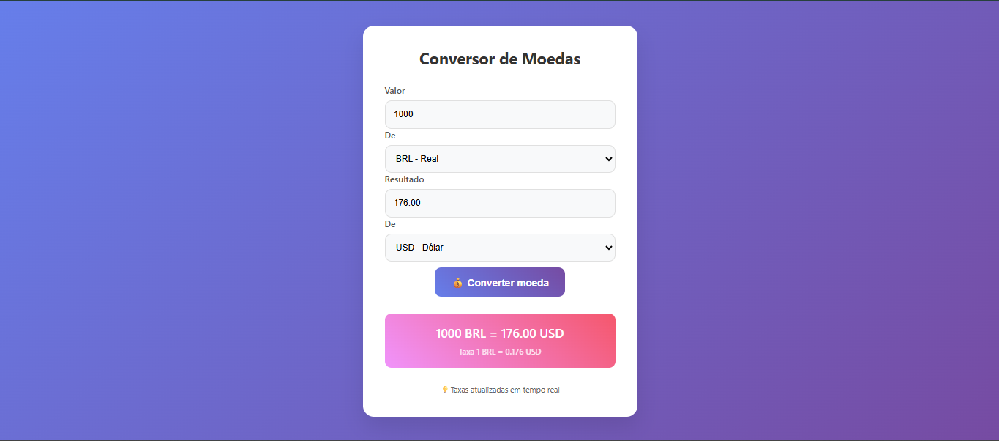

# Conversor de Moedas

Um aplicativo web simples e elegante para converter valores entre diferentes moedas com taxas de câmbio em tempo real.

## 📝 Descrição

Este projeto é um conversor de moedas que permite aos usuários converter valores entre diferentes moedas usando taxas de câmbio atualizadas em tempo real. A aplicação possui uma interface amigável e responsiva, tornando-a fácil de usar em qualquer dispositivo.

## ✨ Funcionalidades

- Conversão entre 10 moedas diferentes (USD, EUR, BRL, GBP, JPY, CAD, AUD, CHF, CNY, ARS)
- Taxas de câmbio atualizadas em tempo real
- Interface de usuário intuitiva e responsiva
- Indicador de carregamento durante a busca de taxas
- Tratamento de erros com mensagens amigáveis
- Design moderno com animações suaves

## 🛠️ Tecnologias Utilizadas

- HTML5
- CSS3 (com Flexbox e animações)
- JavaScript (ES6+)
- Fetch API para requisições HTTP
- [ExchangeRate API](https://www.exchangerate-api.com/) para taxas de câmbio em tempo real

## 🚀 Instalação

1. Clone este repositório:
   ```bash
   git clone https://github.com/MayconRocha21/conversor-de-moedas
   ```

2. Navegue até o diretório do projeto:
   ```bash
   cd conversor-de-moedas
   ```

3. Abra o arquivo `index.html` em seu navegador preferido.

## 💻 Como Usar

1. Digite o valor que deseja converter no campo "Valor"
2. Selecione a moeda de origem no campo "De"
3. Selecione a moeda de destino no campo "Para"
4. Clique no botão "💰 Converter moeda"
5. O resultado da conversão será exibido abaixo do formulário

## 🔑 API

Este projeto utiliza a [ExchangeRate API](https://www.exchangerate-api.com/) para obter taxas de câmbio em tempo real. A API oferece:

- Taxas de câmbio atualizadas para mais de 160 moedas
- Dados confiáveis de fontes financeiras respeitáveis
- Atualizações a cada 24 horas para o plano gratuito

Para usar sua própria chave de API:
1. Registre-se em [ExchangeRate API](https://www.exchangerate-api.com/) para obter uma chave gratuita
2. Substitua a chave de API existente no arquivo `js/scripts.js`:
   ```javascript
   const API_URL = "https://v6.exchangerate-api.com/v6/SUA_CHAVE_AQUI/latest/";
   ```

## 📸 Imagem do Projeto


*Interface do Conversor de Moedas mostrando a conversão de 1000 BRL para USD*

## 🔮 Melhorias Futuras

- Adicionar mais moedas
- Implementar histórico de conversões
- Adicionar gráficos de tendências de câmbio
- Criar tema escuro
- Adicionar opção para salvar conversões favoritas

## 📄 Licença

Este projeto está licenciado sob a Licença MIT - veja o arquivo [LICENSE](LICENSE) para detalhes.

## 👨‍💻 Autor

[Maycon Rocha](https://github.com/MayconRocha21)

---
